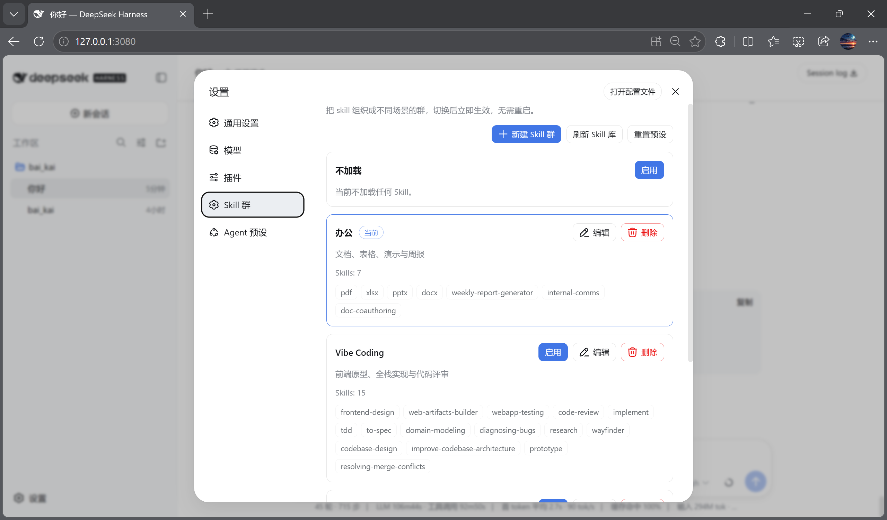
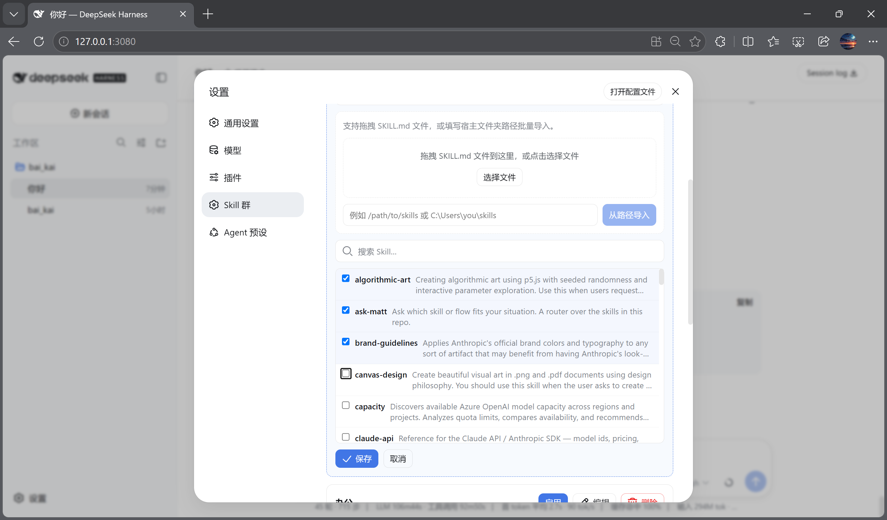
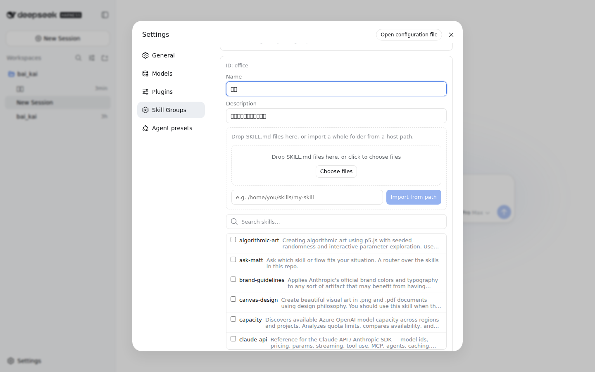
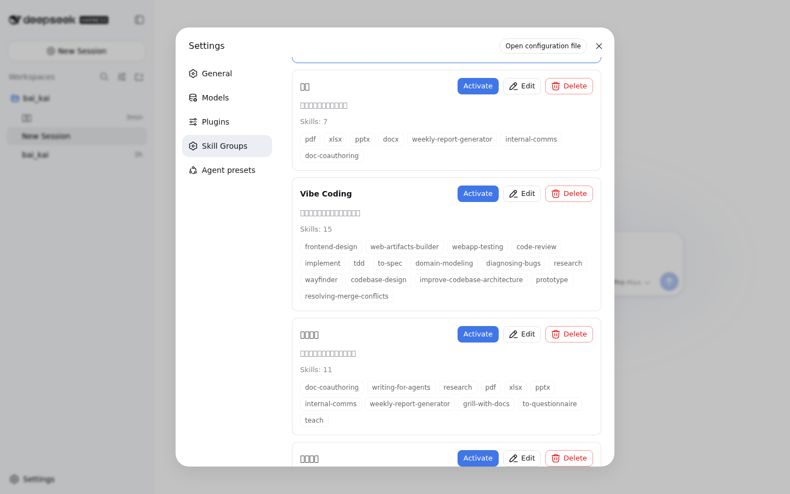

# dsh-skills-manager

众所周知，梁子的 DSH 发布之后，很多人都想从 Claude Code、Codex 以及其他 Agent 工具转过来，体验一下 DS 的原生工具。

但 DSH 的 Skill 支持目前做得还不太直观。移民过来以后，我们很难把原来那套开发习惯原封不动地带进 DSH。

于是我用 DSH + DS 开发了这个开源插件：**dsh-skills-manager**（Skills Manager）。

它能够方便地完成 Skill 的导入和管理，并且提供按任务场景分类的 Skill 集群自由切换能力，帮我们省 Token；同时支持一键全关，让你体会原汁原味的大鲸鱼。

---

## 能力

- 拖拽 `SKILL.md` 文件导入，或填写宿主文件夹路径批量导入
- 新建 / 编辑 / 删除 Skill 群
- 预设场景：
  - 办公
  - Vibe Coding
  - 科研写作
  - 全部启用（自动跟随 Skill 库，后续导入也自动纳入）
  - 不加载
- 切换 Skill 群后立即生效，无需重启 DSH
- 一键刷新 Skill 库
- 一键重置预设
- 与 DSH Web UI 的设计语言保持一致

## 安装

### 普通用户：一条命令

从 GitHub Releases 下载 `dsh-skills-manager-<version>.tgz`，然后：

```bash
dsh plugin --profile web add @baikai233/dsh-skills-manager
dsh web
```

DSH 会自动识别该包为 bundle，并把它加入 profile 的插件层；打开
**设置 → Skill 群** 即可使用。headless 用户：

```bash
dsh plugin --profile headless add @baikai233/dsh-skills-manager
```

### 开发者：从源码构建

```bash
git clone https://github.com/BAIKAI23333/dsh-skills-manager.git
cd dsh-skills-manager

# 需要一份 deepseek-harness 源码（用于 client bundle 构建预设）
HARNESS=~/AI_Coding/deepseek-harness ./scripts/make-release.sh
dsh plugin --profile web add ./release/dsh-skills-manager-0.1.0-rc.1.tgz  # 本地 tarball 验证
```

## 使用

```bash
dsh web
```

打开 **设置 → Skill 群**。

## 截图

| Skill 群 | 新建 + 导入 | 编辑导入 | 不加载 / 全部启用 |
|---|---|---|---|
|  |  |  |  |

## 仓库结构

```text
dsh-skills-manager/
├── packages/
│   ├── dsh-skills-manager/          # 宿主插件
│   └── dsh-client-ui-skills-manager/ # Web 设置页插件
├── docs/screenshots/                 # 界面截图
├── tests/
│   └── skills-manage-visual.mjs      # Playwright 浏览器回归
├── dsh-skills-manager                # 安装/卸载/状态 CLI
└── install.sh
```

## 开发

```bash
# 单元测试（在 deepseek-harness 内）
cd ~/AI_Coding/deepseek-harness
pnpm exec vitest run packages/client/ui-skills-manage/tests/browser-plugin.client.spec.tsx

# 浏览器自动化 + 截图
node apps/web/tests/skills-manage-visual.mjs
```

## License

MIT
